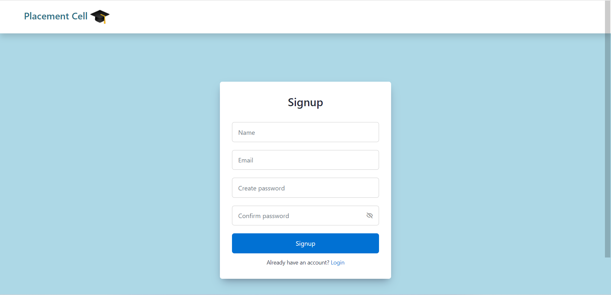
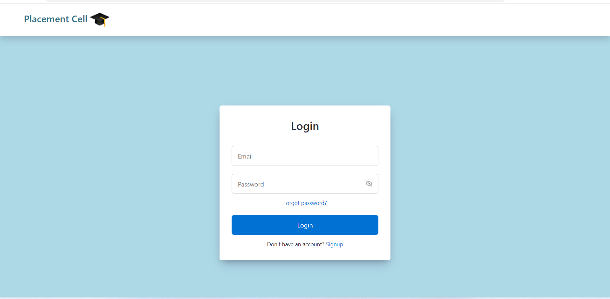
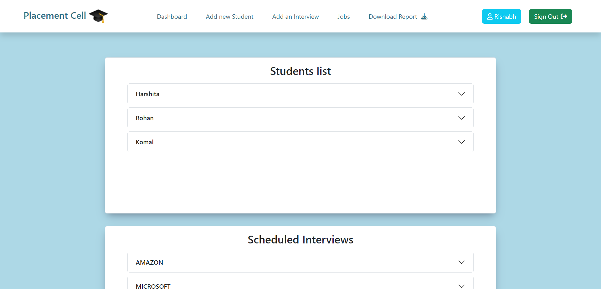
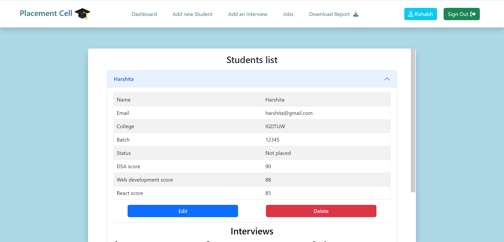
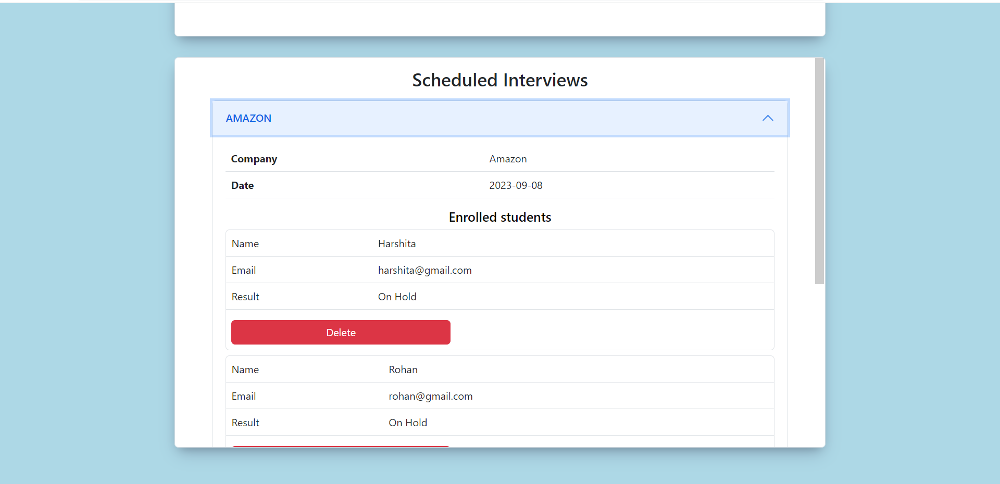
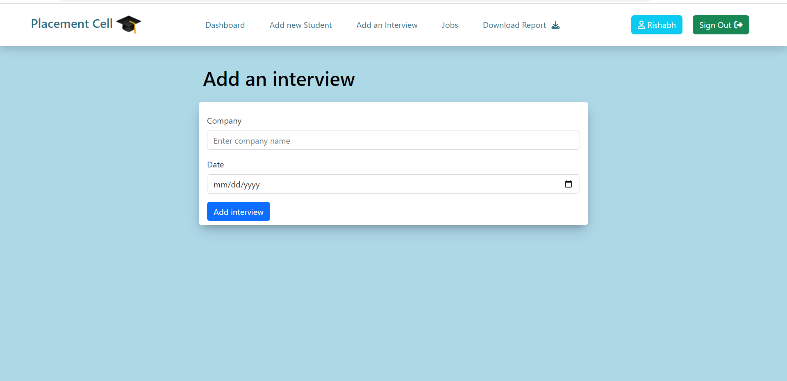
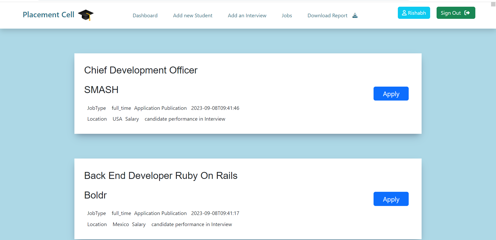

# Placement cell web app
This is a placement cell web application. 
Completed placement cell a web-based application using Nodejs as a backend, MongoDB as Database, EJS for the front end, and Bootstrap for Styling.
Improved the security of the Placement cell web app by using Passportjs and Passport-Local Strategies to authenticate user logins, bcryptjs to encrypt all data and fetch for API call

## Tools Used 
- NodeJS
- MongoDB
- ExpressJS
- EJS
- Bootstrap

### 🔗 Hosted link: 

## Functionality 
- User/Employee signUp and signIn
- Add student 
- Delete student
- Allocate added student to the interview
- Deallocate the student from an interview
- Update user profile
- Download the CSV report
- Find latest jobs on jobs page
 
## Getting started

* Clone the repository in your local system
* Install all required packages
```bash
npm install 
```
* Run project 
```bash
npm start
```


### Libraries: 
* bcryptjs
* connect-mongo
* cookie-parser
* dotenv
* ejs
* express
* express-ejs-layout
* express-session
* mongoose
* passport
* passport-local

## 🖼️ Screenshots

Signup Page



Signin Page



Dashboard Page



Dashboard Page Student Section



Dashboard Page Interview Section



Add Student Page


Add Interview Page


Job Page


